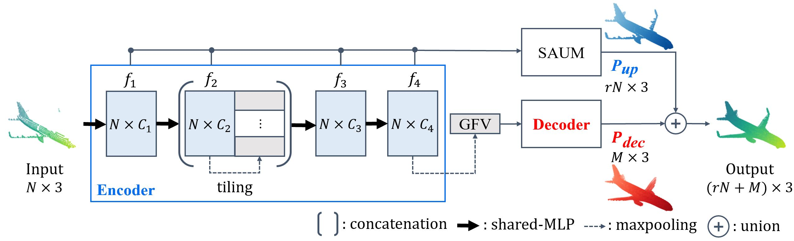

# SAUM
Tensorflow code for the paper [SAUM: Symmetry-Aware Upsampling Module
for Consistent Point Cloud Completion.](https://openaccess.thecvf.com/content/ACCV2020/papers/Son_SAUM_Symmetry-Aware_Upsampling_Module_for_Consistent_Point_Cloud_Completion_ACCV_2020_paper.pdf)

**Hyeontae Son, Young Min Kim**



```bash
@InProceedings{Son_2020_ACCV,
    author    = {Son, Hyeontae and Kim, Young Min},
    title     = {SAUM: Symmetry-Aware Upsampling Module for Consistent Point Cloud Completion},
    booktitle = {Proceedings of the Asian Conference on Computer Vision (ACCV)},
    month     = {November},
    year      = {2020}
}
```

## Prerequisites
### Clone this repository
```git clone https://github.com/countywest/SAUM.git```

### Download & Link datasets
  - [PCN](https://drive.google.com/drive/folders/1P_W1tz5Q4ZLapUifuOE4rFAZp6L1XTJz)
  - [TopNet](http://download.cs.stanford.edu/downloads/completion3d/dataset2019.zip)
  - [KITTI](https://drive.google.com/drive/folders/1fSu0_huWhticAlzLh3Ejpg8zxzqO1z-F)
  - ```mkdir data && ln -s [path to dataset] data/[dataset name]```
    - dataset name: ```pcn, topnet, kitti```

### Preprocess TopNet dataset (optional)
Since TopNet dataset does not provide the ground
truth for test data, we used the provided validation set for testing and picked 600 samples from the training data to use it as a validation set.
Followings are instructions for preparing TopNet dataset same as our experimental setting.
  - ```cd [path to TopNet dataset]```
  - ```rm -rf train.list test test.list && mv val test && mv val.list test.list```
  - copy ```configs/topnet_dataset/*.list``` to the data directory.
  - make ```val``` directory(```partial, gt```) using ```val.list```
  - make new ```train.list``` with remaining training data.

You can also download preprocessed topnet dataset [here](https://drive.google.com/drive/folders/16QFZuNLLX5ClUVlkiU6j2gt30gCcDJLL?usp=sharing).

### Install Dependencies
```pip install -r requirements.txt```

### Build TensorFlow Extensions
Please assign appropriate path to the vars (```cuda_inc, cuda_lib, nvcc, tf_inc, tf_inc_pub, tf_lib```)
in ```fps/tf_sampling_compile.sh``` & ```pc_distance/makefile```

  - ```cd fps && ./tf_sampling_compile.sh```
  - ```cd pc_distance && make```

## Usage
To train the SAUM attached models,

```python train.py --config_path configs/[decoder_name].yaml --log_dir [log_directory]```

To evaluate the result in the test set,

```python test.py --checkpoint [log_directory] --results_dir [result_directory]```

Any hyperparameters can be controlled in the yaml files.

### Pretrained Models
The pretrained models on PCN dataset with decoder PCN and TopNet are available.[[here](https://drive.google.com/drive/folders/1DMNY7Q3mnkz3UpYptXAH97iT9ysVqQLc?usp=sharing)]

## Acknowledgements
This code is based on the project [PCN](https://github.com/wentaoyuan/pcn). Thanks for their great work.
